# Automated Troop Deployment System (Minecraft Education)

An educational project designed to demonstrate advanced programming concepts within **Minecraft Education Edition** using the **MakeCode JavaScript** environment.

## 🚀 Overview
This script automates the deployment of two opposing military factions (Attackers vs. Defenders) along with "Patron" entities. It serves as a practical guide for students to master spatial logic and procedural generation.

## 🎓 Educational Objectives
- **Nested Loops:** Efficiently generating 2D grids (rows x entities).
- **Coordinate Systems:** Mastering relative coordinates (`~x ~y ~z`) for precise entity placement.
- **Clean Code Practices:** Using `camelCase` naming conventions and modular function structures.
- **Hybrid Logic:** Understanding the synergy between JavaScript code and in-game Command Blocks.

## 🛠 Installation & Usage
1. Open **Minecraft Education Edition**.
2. Press `C` to open the **Code Builder**.
3. Click on **"New Project"** to enter the workspace.
4. Select **JavaScript (MakeCode)** from the language toggle at the top of the editor.
5. Paste the entire code from `troops_deployment.js` into the window.

   ## 📸 Project Gallery

### Troop Formations
| Attacking Forces | Defending Forces |
| :---: | :---: |
| 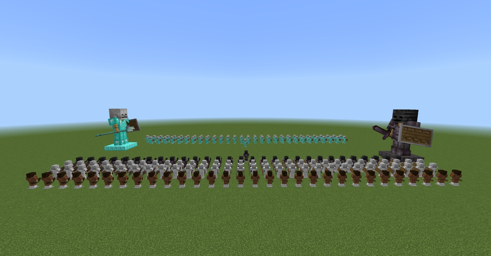 | 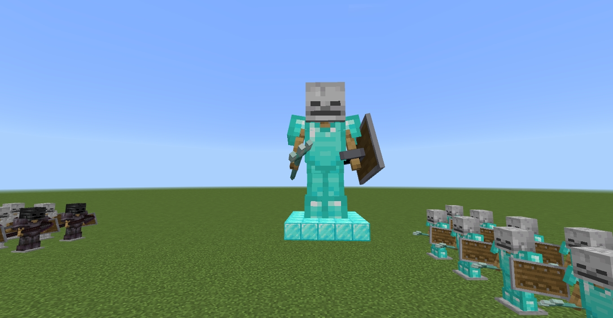 |
| 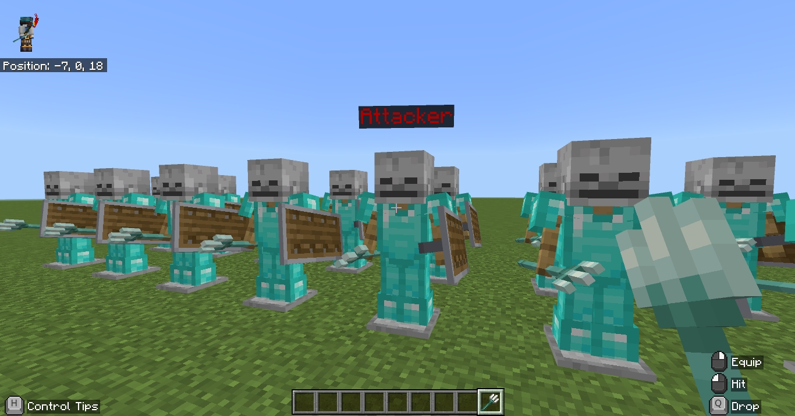 | 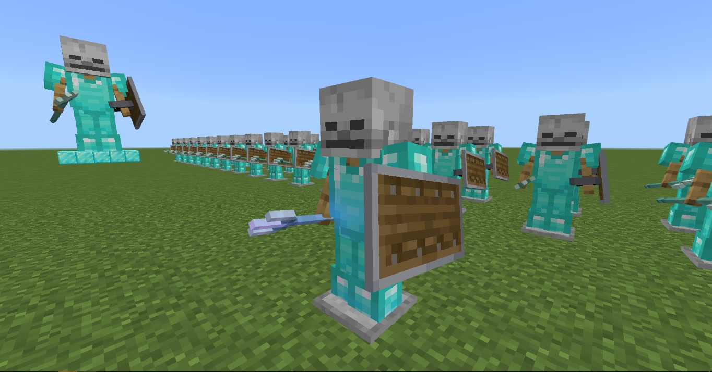 |

### Patrons & Commanders
| Patron of Attackers | Patron of Defenders |
| :---: | :---: |
| 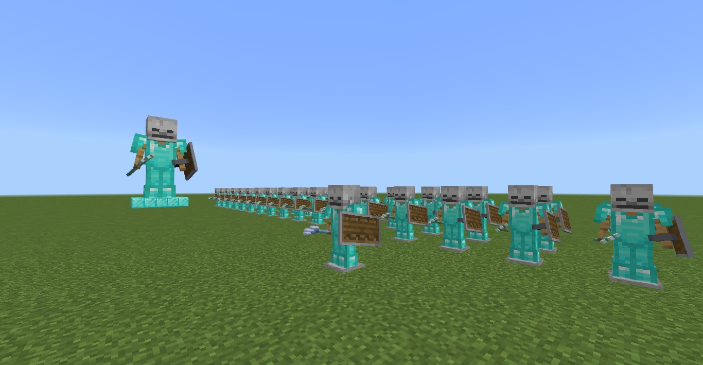 | 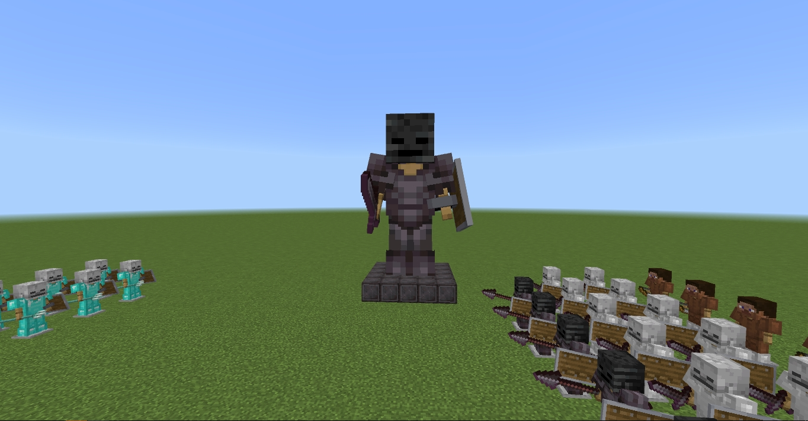 |

  
🔍 Click to view more screenshots

  
  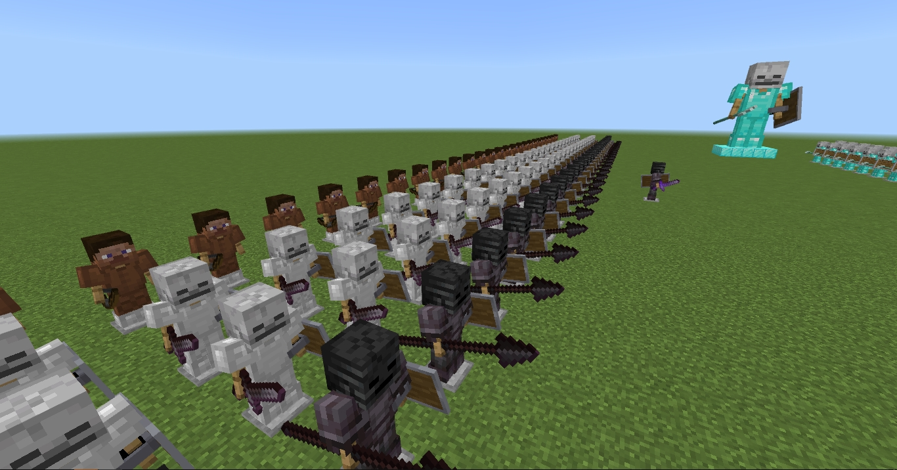
  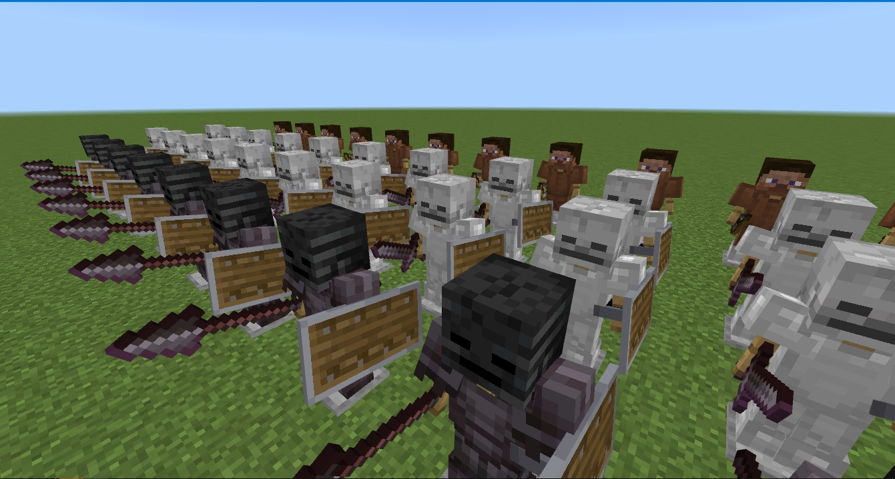
  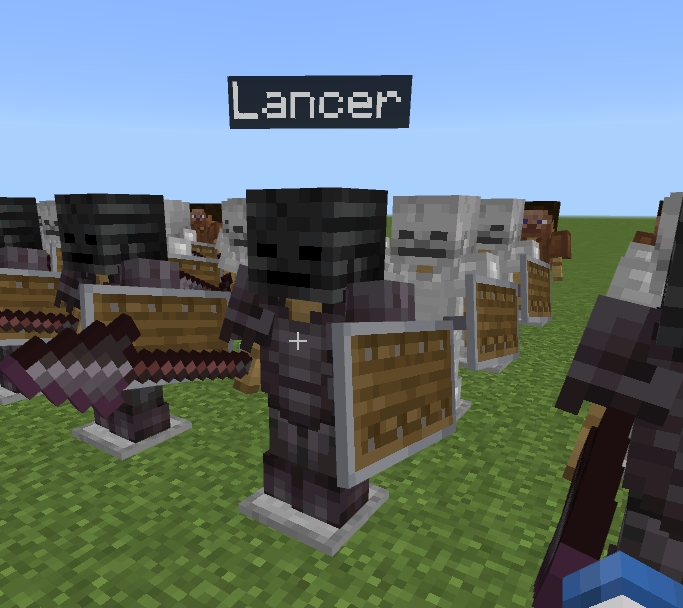
  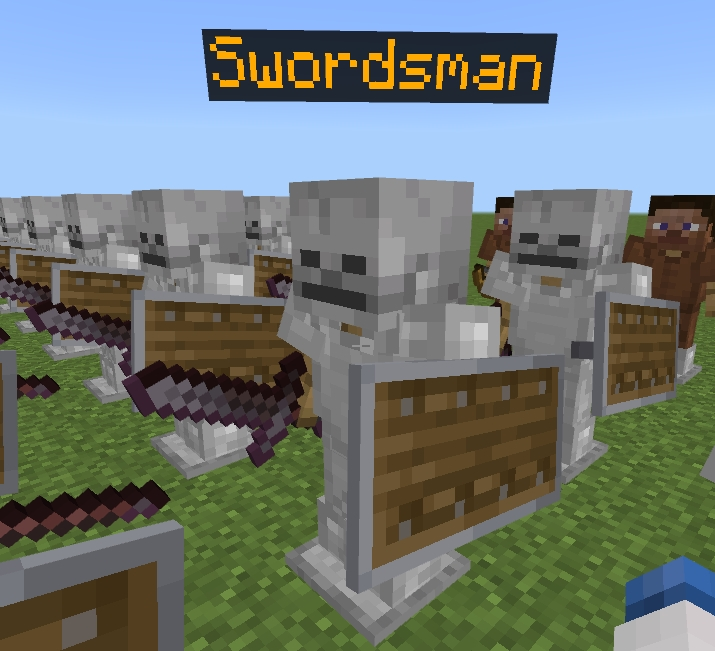
  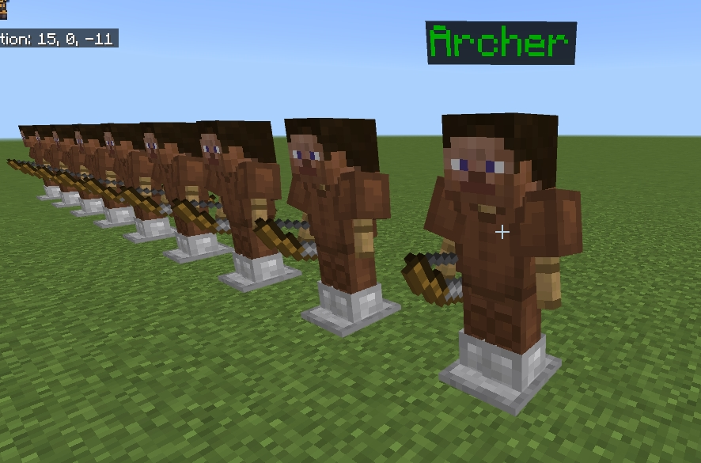
  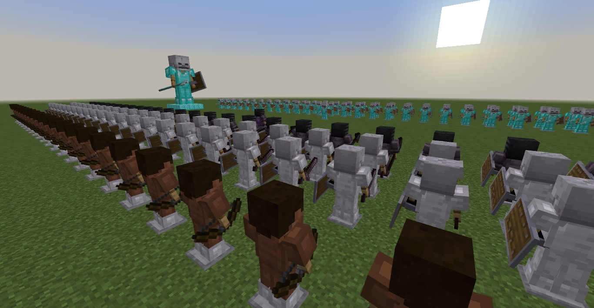

7. Return to the game world.
8. Open the chat (press `T` or `Enter`) and simply type: **troops**

## ⚠️ Technical Note
The scaling effect for "Patron" entities uses the `playanimation` command. For permanent stability across world reloads, it is recommended to mirror this command in a **Repeating Command Block** (Always Active) close to the entity's location.

---
## ⚖️ License
This project is licensed under the **MIT License**.

**Original Concept & Development:** Copyright (c) 2026 Dmytro Ivanenko (@DmytroIvanenko).
Feel free to use, modify, and distribute this code for educational purposes. Attribution is greatly appreciated!
